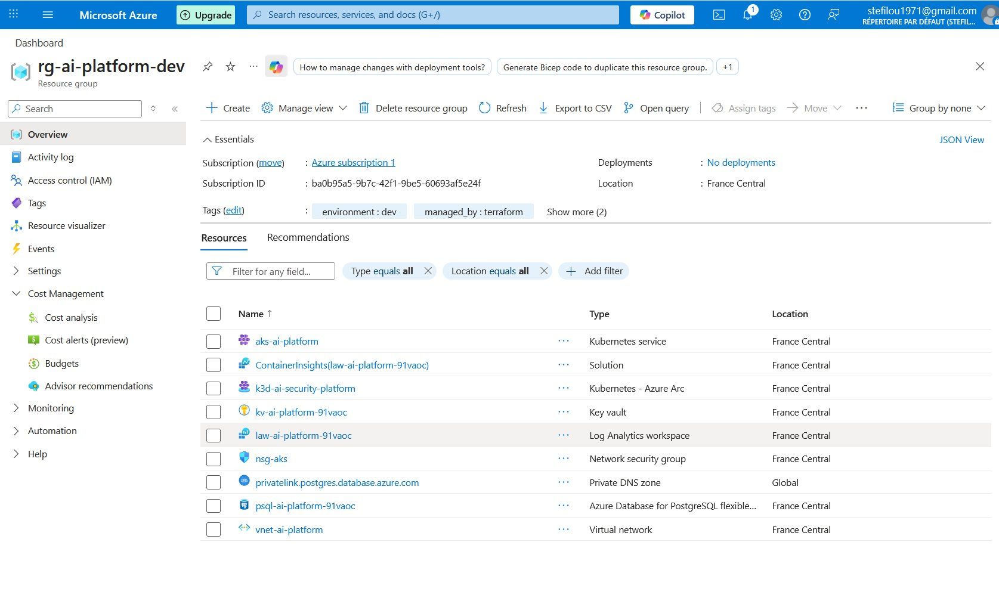
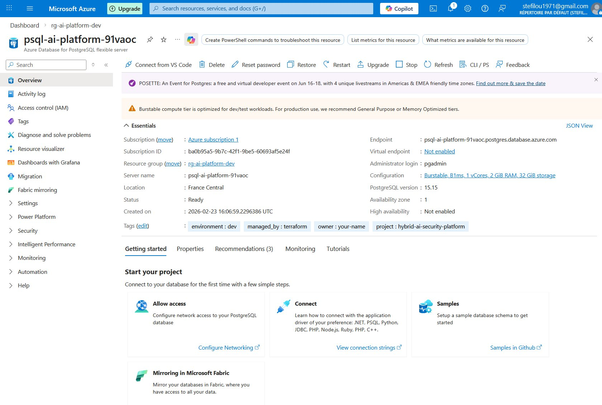
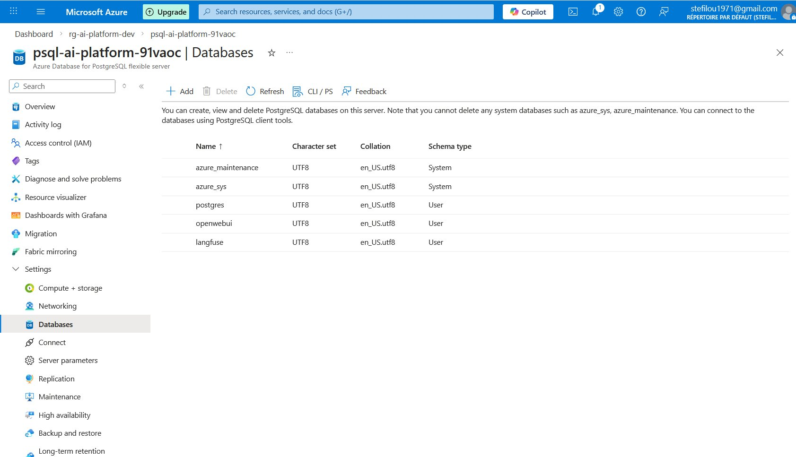
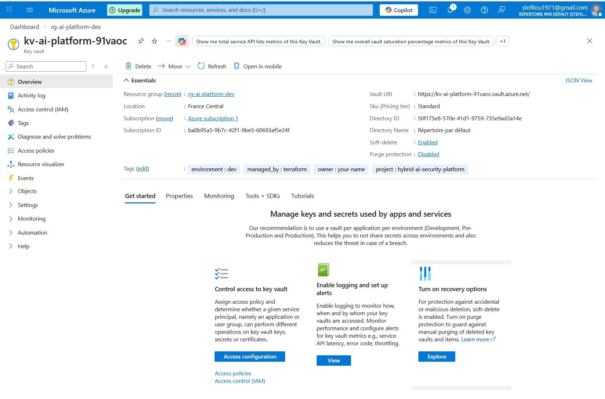
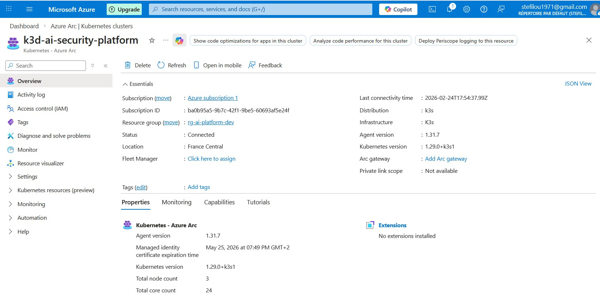
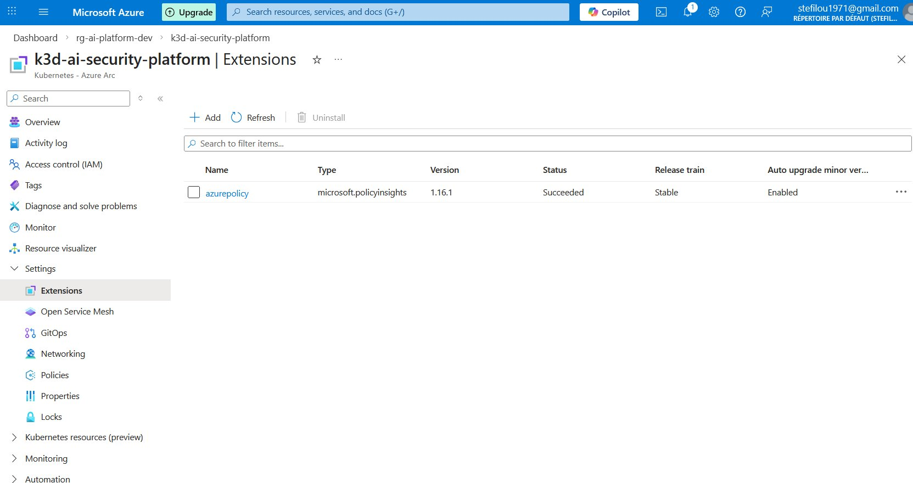
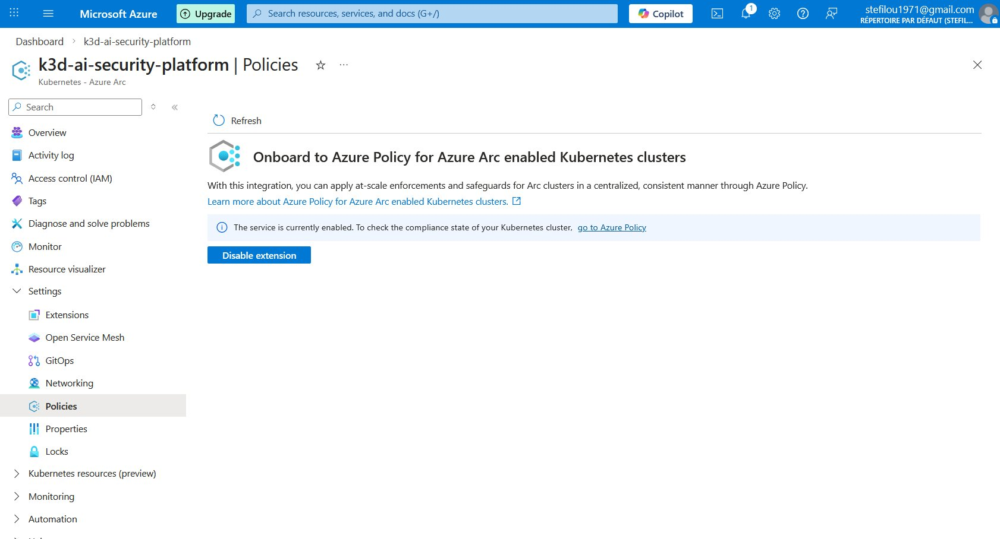

# ☁️ Guide Infrastructure Azure - Hybrid AI Security Platform

## Vue d'ensemble

Ce guide documente l'infrastructure Azure déployée pour la plateforme hybride AI Security, incluant AKS, Azure Arc, PostgreSQL, Key Vault et les services associés.

## 📋 Table des matières

1. [Architecture globale](#architecture-globale)
2. [Resource Group](#resource-group)
3. [PostgreSQL Flexible Server](#postgresql-flexible-server)
4. [Key Vault](#key-vault)
5. [Azure Arc - K3d](#azure-arc---k3d)
6. [Coûts](#coûts)
7. [Scripts de gestion](#scripts-de-gestion)

---

## Architecture globale

```
┌─────────────────────────────────────────────────────────────────────────┐
│                    HYBRID AI SECURITY PLATFORM                           │
│                                                                         │
│  ┌─────────────────────────────────────────────────────────────────┐   │
│  │                         AZURE CLOUD                              │   │
│  │                                                                  │   │
│  │  Resource Group: rg-ai-platform-dev                             │   │
│  │  Location: France Central                                        │   │
│  │                                                                  │   │
│  │  ┌──────────────┐  ┌──────────────┐  ┌──────────────┐          │   │
│  │  │     AKS      │  │  PostgreSQL  │  │   Key Vault  │          │   │
│  │  │ aks-ai-      │  │ psql-ai-     │  │ kv-ai-       │          │   │
│  │  │ platform     │  │ platform     │  │ platform     │          │   │
│  │  │              │  │              │  │              │          │   │
│  │  │ • ArgoCD     │  │ • langfuse   │  │ • secrets    │          │   │
│  │  │ • OpenWebUI  │  │ • openwebui  │  │ • passwords  │          │   │
│  │  └──────────────┘  │ • postgres   │  └──────────────┘          │   │
│  │         │          └──────────────┘                             │   │
│  │         │                                                        │   │
│  │  ┌──────────────┐  ┌──────────────┐  ┌──────────────┐          │   │
│  │  │  Azure Arc   │  │    VNet      │  │Log Analytics │          │   │
│  │  │ k3d-ai-      │  │ vnet-ai-     │  │ law-ai-      │          │   │
│  │  │ security-    │  │ platform     │  │ platform     │          │   │
│  │  │ platform     │  │              │  │              │          │   │
│  │  │              │  │ 10.0.0.0/16  │  │ • logs       │          │   │
│  │  │ (on-prem)    │  │              │  │ • metrics    │          │   │
│  │  └──────────────┘  └──────────────┘  └──────────────┘          │   │
│  │         │                                                        │   │
│  └─────────│────────────────────────────────────────────────────────┘   │
│            │ Azure Arc connection                                       │
│            │                                                            │
│  ┌─────────│────────────────────────────────────────────────────────┐   │
│  │         ▼            ON-PREMISES (WSL2)                          │   │
│  │                                                                  │   │
│  │  ┌──────────────────────────────────────────────────────────┐   │   │
│  │  │                    K3d Cluster                            │   │   │
│  │  │                                                           │   │   │
│  │  │  • Ollama + Mistral     • Keycloak                       │   │   │
│  │  │  • Open WebUI           • Falco                          │   │   │
│  │  │  • RAG API + Qdrant     • Kyverno                        │   │   │
│  │  │  • PostgreSQL (CNPG)    • Prometheus/Grafana             │   │   │
│  │  │                                                           │   │   │
│  │  └──────────────────────────────────────────────────────────┘   │   │
│  └─────────────────────────────────────────────────────────────────┘   │
│                                                                         │
└─────────────────────────────────────────────────────────────────────────┘
```

---

## Resource Group

### Vue d'ensemble

Le Resource Group `rg-ai-platform-dev` contient toutes les ressources Azure de la plateforme.



### Ressources déployées

| Ressource | Type | Description |
|-----------|------|-------------|
| **aks-ai-platform** | Kubernetes service | Cluster AKS managé |
| **k3d-ai-security-platform** | Kubernetes - Azure Arc | Cluster K3d connecté via Arc |
| **psql-ai-platform-91vaoc** | Azure Database for PostgreSQL | Base de données managée |
| **kv-ai-platform-91vaoc** | Key vault | Gestion des secrets |
| **vnet-ai-platform** | Virtual network | Réseau virtuel (10.0.0.0/16) |
| **law-ai-platform-91vaoc** | Log Analytics workspace | Centralisation des logs |
| **nsg-aks** | Network security group | Règles firewall |

### Tags

Toutes les ressources sont taguées pour la gestion :

| Tag | Valeur |
|-----|--------|
| `environment` | dev |
| `managed_by` | terraform |
| `project` | hybrid-ai-security-platform |
| `owner` | your-name |

---

## PostgreSQL Flexible Server

### Vue d'ensemble

Azure Database for PostgreSQL Flexible Server héberge les bases de données pour Langfuse et OpenWebUI.



### Caractéristiques

| Paramètre | Valeur |
|-----------|--------|
| **Server name** | psql-ai-platform-91vaoc |
| **Location** | France Central |
| **Version** | 15.15 |
| **SKU** | Burstable, B1ms (1 vCore, 2 GiB RAM) |
| **Storage** | 32 GiB |
| **Administrator** | pgadmin |
| **Endpoint** | psql-ai-platform-91vaoc.postgres.database.azure.com |

### Databases



| Database | Type | Usage |
|----------|------|-------|
| **postgres** | User | Database par défaut |
| **langfuse** | User | LLM observability |
| **openwebui** | User | Interface utilisateur |
| **azure_maintenance** | System | Maintenance Azure |
| **azure_sys** | System | Système Azure |

### Connexion

```bash
# Récupérer le mot de passe depuis Key Vault
az keyvault secret show \
  --vault-name kv-ai-platform-91vaoc \
  --name postgres-admin-password \
  --query value -o tsv

# Connexion
psql "host=psql-ai-platform-91vaoc.postgres.database.azure.com \
      port=5432 \
      dbname=langfuse \
      user=pgadmin \
      sslmode=require"
```

---

## Key Vault

### Vue d'ensemble

Azure Key Vault stocke les secrets de la plateforme de manière sécurisée.



### Caractéristiques

| Paramètre | Valeur |
|-----------|--------|
| **Vault name** | kv-ai-platform-91vaoc |
| **SKU** | Standard |
| **Soft-delete** | Enabled |
| **Purge protection** | Disabled |
| **Vault URI** | https://kv-ai-platform-91vaoc.vault.azure.net/ |

### Secrets stockés

| Secret | Description |
|--------|-------------|
| `postgres-admin-password` | Mot de passe PostgreSQL |

### Accès aux secrets

```bash
# Lister les secrets
az keyvault secret list --vault-name kv-ai-platform-91vaoc

# Récupérer un secret
az keyvault secret show \
  --vault-name kv-ai-platform-91vaoc \
  --name postgres-admin-password \
  --query value -o tsv
```

---

## Azure Arc - K3d

### Vue d'ensemble

Le cluster K3d local est connecté à Azure via Azure Arc, permettant une gestion centralisée.



### Caractéristiques

| Paramètre | Valeur |
|-----------|--------|
| **Name** | k3d-ai-security-platform |
| **Status** | Connected ✅ |
| **Distribution** | K3s |
| **Infrastructure** | K3s |
| **Kubernetes version** | 1.29.0+k3s1 |
| **Agent version** | 1.31.7 |
| **Total nodes** | 3 |
| **Total cores** | 24 |

### Extensions installées



| Extension | Type | Version | Status |
|-----------|------|---------|--------|
| **azurepolicy** | microsoft.policyinsights | 1.16.1 | Succeeded ✅ |

### Azure Policy



Azure Policy est activé sur le cluster, permettant l'application de policies de gouvernance.

> ℹ️ The service is currently enabled. To check the compliance state of your Kubernetes cluster, go to Azure Policy.

### Agents Arc (pods)

```bash
kubectl get pods -n azure-arc
```

| Pod | Rôle |
|-----|------|
| **clusterconnect-agent** | Connexion au plan de contrôle Azure |
| **extension-agent** | Gestion des extensions |
| **extension-operator** | Orchestration des extensions |
| **flux-logs-agent** | Collecte des logs Flux |
| **kube-aad-proxy** | Proxy Azure AD |
| **cluster-metadata-operator** | Métadonnées du cluster |
| **controller-manager** | Contrôleur Arc |
| **resource-sync-agent** | Synchronisation des ressources |
| **metrics-agent** | Collecte des métriques |
| **config-agent** | Configuration |

---

## Coûts

### Estimation mensuelle

| Ressource | Coût/mois | Notes |
|-----------|-----------|-------|
| **AKS** | ~$0 | Free tier (gestion gratuite) |
| **AKS Node** | ~$15 | Standard_B2s_v2 |
| **PostgreSQL** | ~$13 | B1ms Burstable |
| **Key Vault** | ~$0.03 | Secrets storage |
| **Log Analytics** | ~$0 | Ingestion gratuite <5GB |
| **Azure Arc** | $0 | Gratuit |
| **Azure Policy** | $0 | Gratuit |
| **VNet** | $0 | Gratuit |

**Total estimé : ~$28/mois**

### Optimisation des coûts

```bash
# Stopper les ressources (économie ~90%)
./scripts/azure-stop-all.sh

# Démarrer les ressources
./scripts/azure-start-all.sh
```

---

## Scripts de gestion

### Démarrer l'infrastructure

```bash
#!/bin/bash
# scripts/azure-start-all.sh

# Démarrer PostgreSQL
az postgres flexible-server start \
  --resource-group rg-ai-platform-dev \
  --name psql-ai-platform-91vaoc

# Démarrer AKS
az aks start \
  --resource-group rg-ai-platform-dev \
  --name aks-ai-platform

# Démarrer K3d
k3d cluster start ai-security-platform
```

### Stopper l'infrastructure

```bash
#!/bin/bash
# scripts/azure-stop-all.sh

# Stopper AKS (économise le node)
az aks stop \
  --resource-group rg-ai-platform-dev \
  --name aks-ai-platform

# Stopper PostgreSQL
az postgres flexible-server stop \
  --resource-group rg-ai-platform-dev \
  --name psql-ai-platform-91vaoc

# Stopper K3d
k3d cluster stop ai-security-platform
```

### Vérifier la connexion Arc

```bash
# Status de la connexion
az connectedk8s show \
  --name k3d-ai-security-platform \
  --resource-group rg-ai-platform-dev \
  --query connectivityStatus

# Agents Arc
kubectl get pods -n azure-arc
```

---

## Terraform

L'infrastructure est déployée via Terraform :

```
terraform/azure/
├── main.tf              # Ressources principales
├── variables.tf         # Variables
├── outputs.tf           # Outputs
├── versions.tf          # Provider versions
├── terraform.tfvars     # Valeurs des variables
└── terraform.tfstate    # État Terraform
```

### Déploiement

```bash
cd terraform/azure
terraform init
terraform plan
terraform apply
```

### Ressources gérées

- Resource Group
- AKS Cluster
- PostgreSQL Flexible Server
- Key Vault
- Virtual Network
- Log Analytics Workspace
- Network Security Group

---

## Résumé

| Composant | Status | Type |
|-----------|--------|------|
| **Resource Group** | ✅ Déployé | Azure |
| **AKS** | ✅ Running | Managed K8s |
| **PostgreSQL** | ✅ Ready | Managed DB |
| **Key Vault** | ✅ Active | Secrets |
| **Azure Arc** | ✅ Connected | Hybrid |
| **Azure Policy** | ✅ Enabled | Governance |
| **K3d (local)** | ✅ Running | On-premises |

```
Infrastructure hybride Azure + On-premises = Gouvernance unifiée ! 
```

---

*Document créé le 25/02/2026 - Projet hybrid-ai-security-platform*
*Auteur : Stéphane (Z3ROX) - Lead SecOps/Cloud Security Architect*
