# 🛡️ Guide Azure Policy pour Kubernetes

## Vue d'ensemble

Ce guide documente la mise en place d'Azure Policy pour la gouvernance des clusters Kubernetes, aussi bien AKS (natif) que K3d (via Azure Arc).

## 📋 Table des matières

1. [Qu'est-ce qu'Azure Policy ?](#quest-ce-quazure-policy-)
2. [Architecture](#architecture)
3. [Assigner une Policy](#assigner-une-policy)
4. [Compliance Dashboard](#compliance-dashboard)
5. [Policies Kubernetes recommandées](#policies-kubernetes-recommandées)
6. [Exemptions](#exemptions)
7. [Comparaison avec Kyverno](#comparaison-avec-kyverno)
8. [Coûts](#coûts)

---

## Qu'est-ce qu'Azure Policy ?

Azure Policy est un service de gouvernance qui permet de :

- **Auditer** les ressources non conformes
- **Bloquer** la création de ressources non conformes
- **Remédier** automatiquement les écarts de configuration

### Pour Kubernetes spécifiquement

```
┌─────────────────────────────────────────────────────────────────────────┐
│                     AZURE POLICY POUR KUBERNETES                         │
│                                                                         │
│  Azure Policy définit des règles qui sont traduites en contraintes      │
│  OPA/Gatekeeper et déployées sur les clusters.                          │
│                                                                         │
│  ┌─────────────────┐     ┌─────────────────┐     ┌─────────────────┐   │
│  │  Azure Portal   │────>│  Policy Engine  │────>│  Gatekeeper     │   │
│  │  (Définition)   │     │  (Traduction)   │     │  (Enforcement)  │   │
│  └─────────────────┘     └─────────────────┘     └─────────────────┘   │
│                                                         │               │
│                                                         ▼               │
│                                                  ┌─────────────────┐   │
│                                                  │  Cluster K8s    │   │
│                                                  │  (AKS ou Arc)   │   │
│                                                  └─────────────────┘   │
└─────────────────────────────────────────────────────────────────────────┘
```

---

## Architecture

### Flux de fonctionnement

```
┌─────────────────────────────────────────────────────────────────────────┐
│                         WORKFLOW AZURE POLICY                            │
│                                                                         │
│  1. DÉFINITION (Azure Portal)                                           │
│     Policy: "Kubernetes clusters should not allow container             │
│              privilege escalation"                                      │
│     Effect: Audit / Deny                                                │
│     Scope: Subscription / Resource Group / Cluster                      │
│                               │                                         │
│                               ▼                                         │
│  2. ASSIGNATION                                                         │
│     Scope: Azure subscription 1                                         │
│     Clusters ciblés:                                                    │
│       • aks-ai-platform (AKS natif)                                     │
│       • k3d-ai-security-platform (via Azure Arc)                        │
│                               │                                         │
│                               ▼                                         │
│  3. SYNCHRONISATION                                                     │
│     Azure Policy Agent ────sync────> Gatekeeper (dans cluster)          │
│     Les contraintes OPA sont créées automatiquement                     │
│                               │                                         │
│                               ▼                                         │
│  4. ÉVALUATION (toutes les 15 minutes)                                  │
│     Pour chaque pod/deployment/service:                                 │
│       • Vérifie la conformité                                           │
│       • Rapporte à Azure                                                │
│       • Bloque si Effect=Deny                                           │
│                               │                                         │
│                               ▼                                         │
│  5. REPORTING                                                           │
│     Azure Portal → Policy → Compliance                                  │
│       • % conformité par cluster                                        │
│       • Liste des ressources non-conformes                              │
│       • Historique des violations                                       │
└─────────────────────────────────────────────────────────────────────────┘
```

### Clusters couverts

```
┌─────────────────────────────────────────────────────────────────────────┐
│                      AZURE POLICY SCOPE                                  │
│                                                                         │
│  Azure Subscription                                                     │
│  │                                                                      │
│  └── Resource Group: rg-ai-platform-dev                                 │
│      │                                                                  │
│      ├── AKS: aks-ai-platform                                          │
│      │   └── Azure Policy: Natif ✅                                    │
│      │                                                                  │
│      └── Arc: k3d-ai-security-platform                                 │
│          └── Azure Policy: Via extension ✅                            │
│                                                                         │
│  Les deux clusters sont évalués par la même policy !                    │
│  → Gouvernance centralisée pour environnements hybrides                 │
└─────────────────────────────────────────────────────────────────────────┘
```

---

## Assigner une Policy

### Étape 1 : Accéder à Azure Policy

1. Va dans **Azure Portal**
2. Recherche **"Policy"** dans la barre de recherche
3. Clique sur **Policy**

Tu arrives sur le dashboard Policy Overview :

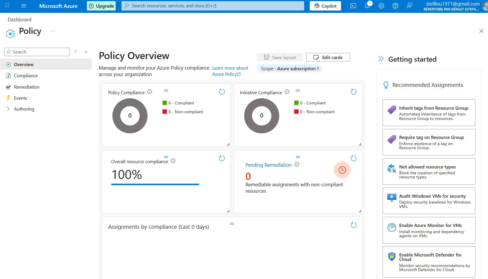

### Étape 2 : Aller dans Assignments

1. Dans le menu gauche, clique sur **"Authoring"**
2. Puis clique sur **"Assignments"**

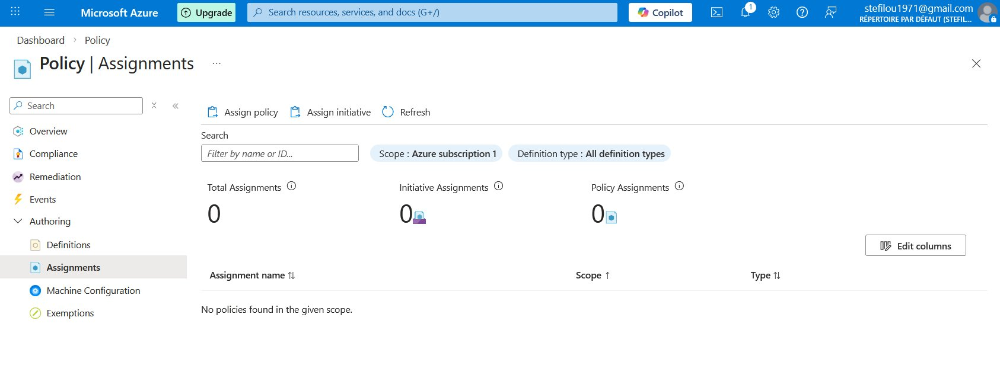

### Étape 3 : Créer une nouvelle Assignment

Clique sur **"Assign policy"** en haut de la page.

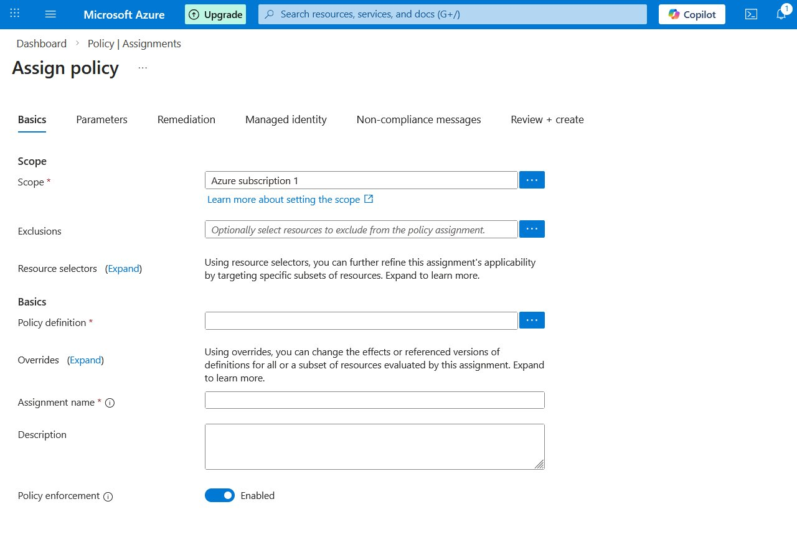

### Étape 4 : Sélectionner la Policy definition

1. Clique sur les **"..."** à côté de **Policy definition**
2. Dans la recherche, tape **"kubernetes"**

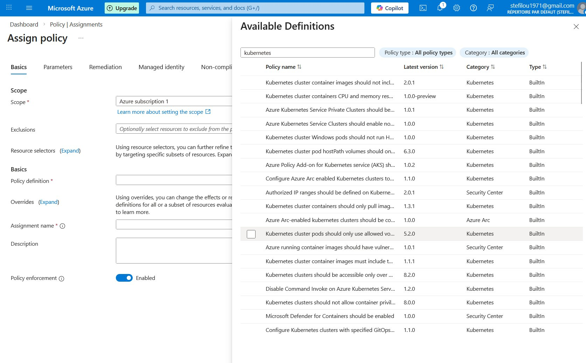

3. Sélectionne **"Kubernetes clusters should not allow container privilege escalation"** (version 8.0.0)

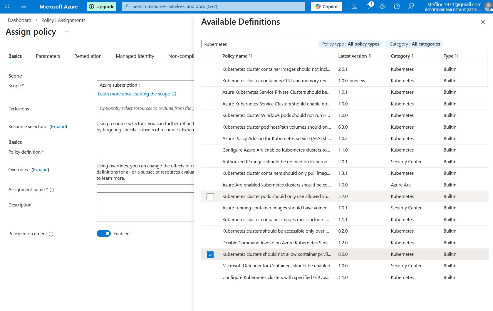

### Étape 5 : Vérifier les Basics

Après sélection, le formulaire se remplit automatiquement :

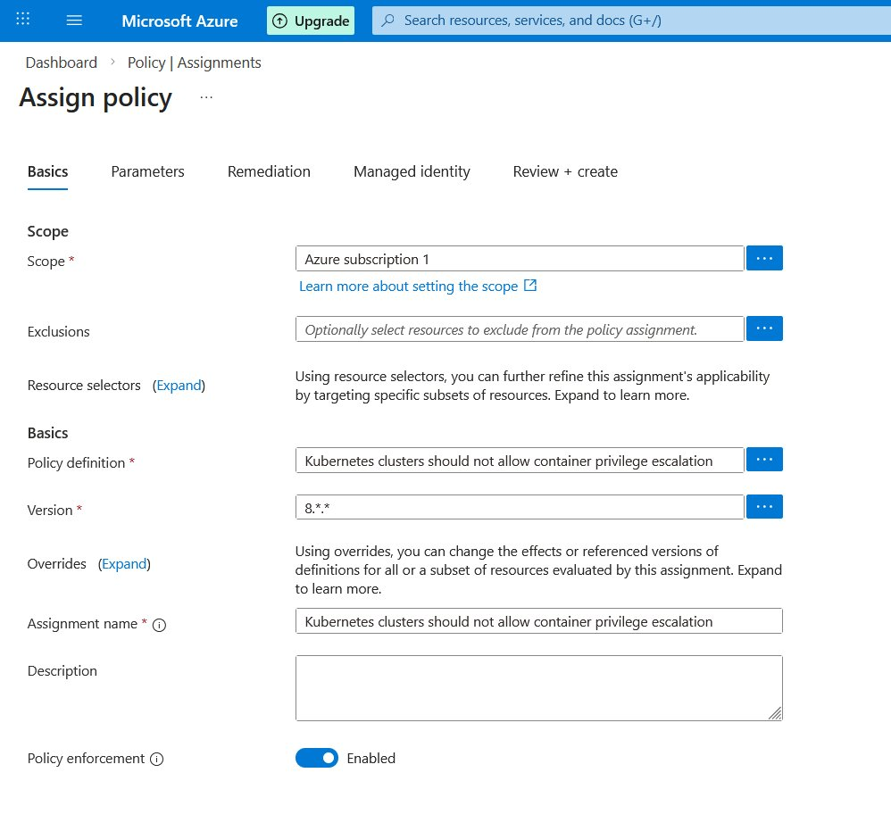

| Champ | Valeur |
|-------|--------|
| **Scope** | Azure subscription 1 |
| **Policy definition** | Kubernetes clusters should not allow container privilege escalation |
| **Version** | 8.*.* |
| **Assignment name** | (auto-généré) |
| **Policy enforcement** | Enabled ✅ |

### Étape 6 : Configurer les Parameters

Clique sur l'onglet **"Parameters"** :

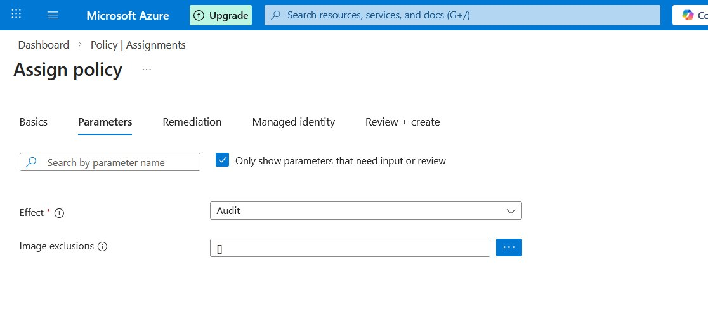

| Paramètre | Valeur recommandée | Description |
|-----------|-------------------|-------------|
| **Effect** | Audit | Log sans bloquer (recommandé au début) |
| **Image exclusions** | [] | Images à exclure |

> 💡 **Conseil** : Commence toujours par **Audit** pour voir l'impact avant de passer en **Deny**

### Étape 7 : Review + Create

Clique sur l'onglet **"Review + create"** pour voir le résumé :

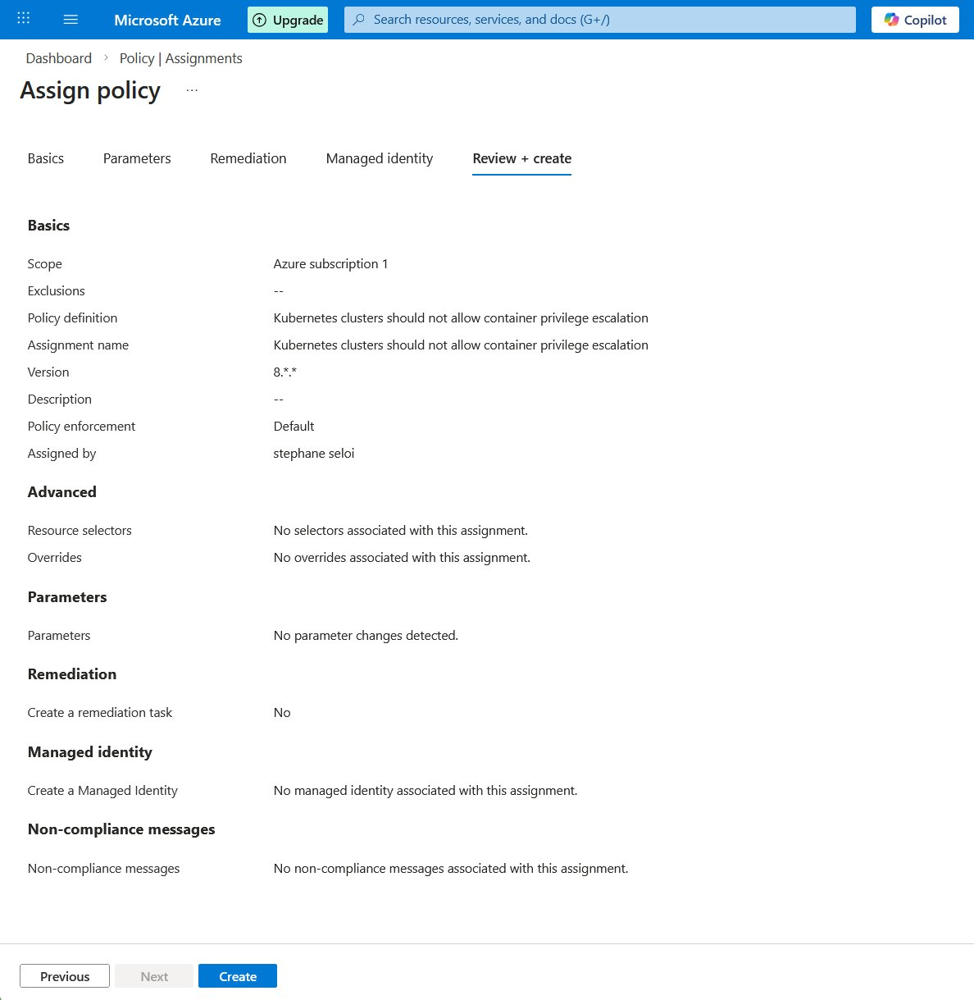

Vérifie les informations et clique sur **"Create"**.

### Étape 8 : Vérifier la création

Retourne dans **Assignments** pour voir ta policy :

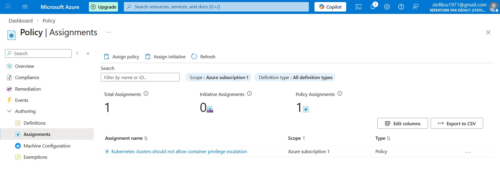

✅ La policy est maintenant assignée à toute ta subscription !

---

## Compliance Dashboard

### Attente de l'évaluation initiale

Juste après la création, le status est **"Not started"** :

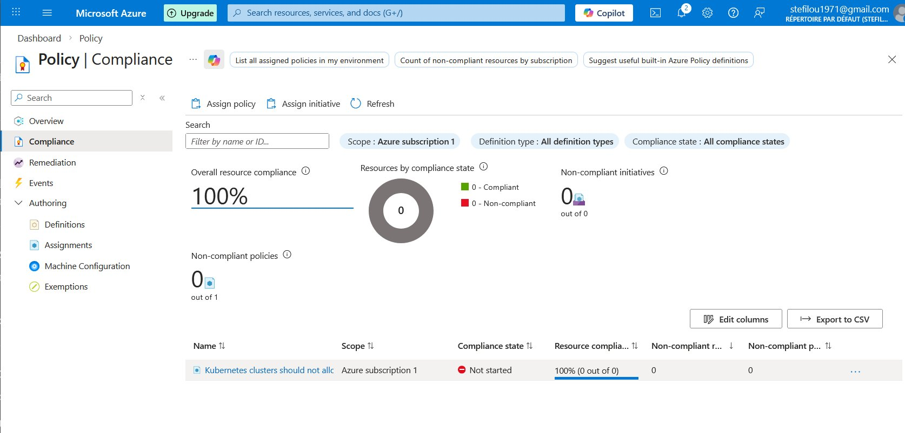

> ⏳ L'évaluation initiale prend **15-30 minutes**. Soit patient !

### Résultats de compliance

Après l'évaluation, tu verras les violations :

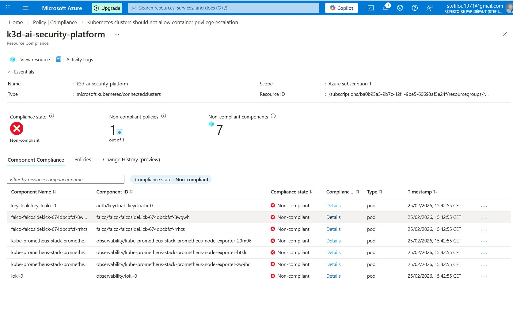

### Interpréter les résultats

| Info | Valeur |
|------|--------|
| **Cluster** | k3d-ai-security-platform |
| **Compliance state** | ❌ Non-compliant |
| **Non-compliant policies** | 1 out of 1 |
| **Non-compliant components** | 7 pods |

### Pods non-conformes typiques (et pourquoi c'est normal)

| Pod | Namespace | Raison du privilège |
|-----|-----------|---------------------|
| **keycloak-keycloakx-0** | auth | Gestion des sessions et tokens |
| **falco-falcosidekick-xxx** | falco | Forward des alertes Falco |
| **prometheus-node-exporter-xxx** | observability | Métriques système (CPU, RAM, disques) |
| **loki-0** | observability | Collecte des logs système |

> 💡 Ces outils de **sécurité et monitoring** ont besoin de privilèges. C'est un cas classique où il faut créer des **exemptions**.

---

## Policies Kubernetes recommandées

### Sécurité de base

| Policy | Description | Effect recommandé |
|--------|-------------|-------------------|
| **No privilege escalation** | Bloque allowPrivilegeEscalation | Audit → Deny |
| **No privileged containers** | Bloque containers privileged | Audit → Deny |
| **No host network** | Bloque hostNetwork: true | Audit → Deny |
| **No host PID** | Bloque hostPID: true | Audit → Deny |
| **Read-only root filesystem** | Force readOnlyRootFilesystem | Audit |

### Images et registres

| Policy | Description | Effect recommandé |
|--------|-------------|-------------------|
| **Allowed registries** | Whitelist de registres autorisés | Deny |
| **No latest tag** | Interdit le tag :latest | Audit → Deny |
| **Image signatures** | Vérifie les signatures d'images | Deny |

### Ressources et limites

| Policy | Description | Effect recommandé |
|--------|-------------|-------------------|
| **Container limits** | Force CPU/memory limits | Audit |
| **Container requests** | Force CPU/memory requests | Audit |

---

## Exemptions

### Quand créer une exemption ?

- Le pod a **légitimement besoin** de privilèges (Falco, monitoring)
- C'est un **composant système** (CNI, CSI drivers)
- C'est **temporaire** pendant une migration

### Créer une exemption

1. **Policy** → **Exemptions**
2. **Create exemption**

| Champ | Valeur | Description |
|-------|--------|-------------|
| **Name** | falco-exemption | Nom descriptif |
| **Scope** | Resource Group ou Cluster | Où appliquer |
| **Policy assignment** | (sélectionner) | Quelle policy |
| **Exemption category** | Waiver ou Mitigated | Type d'exemption |
| **Expiration** | (optionnel) | Date d'expiration |

### Catégories d'exemption

| Category | Description | Exemple |
|----------|-------------|---------|
| **Waiver** | On accepte le risque | Outil de sécurité qui a besoin de privilèges |
| **Mitigated** | Le risque est atténué | Contrôle compensatoire mis en place |

### Exemptions recommandées pour notre plateforme

| Pod/Namespace | Category | Justification |
|---------------|----------|---------------|
| falco/* | Waiver | Outil de sécurité runtime |
| observability/prometheus-node-exporter | Waiver | Monitoring système |
| observability/loki | Mitigated | Logs avec RBAC strict |
| auth/keycloak | Mitigated | IAM avec network policies |
| calico-system/* | Waiver | CNI système |

---

## Comparaison avec Kyverno

### Azure Policy vs Kyverno

| Critère | Azure Policy | Kyverno |
|---------|--------------|---------|
| **Gestion** | Azure Portal (centralisée) | kubectl (par cluster) |
| **Syntaxe** | JSON/ARM | YAML natif K8s |
| **Multi-cluster** | ✅ Natif | ❌ Manuel |
| **Audit centralisé** | ✅ Azure Portal | ❌ Par cluster |
| **Offline** | ❌ Besoin Azure | ✅ Fonctionne offline |
| **Mutations** | ❌ Non | ✅ Oui |
| **Generate resources** | ❌ Non | ✅ Oui |
| **Coût** | Gratuit | Gratuit |

### Stratégie recommandée : Defense in Depth

```
┌─────────────────────────────────────────────────────────────────────────┐
│                    DEFENSE IN DEPTH                                      │
│                                                                         │
│  LAYER 1: Azure Policy (Gouvernance globale)                            │
│    • Policies de base (no privileged, no hostNetwork)                   │
│    • Compliance reporting centralisé                                    │
│    • Audit trail Azure                                                  │
│                               +                                         │
│  LAYER 2: Kyverno (Policies spécifiques)                                │
│    • Mutations (auto-add labels, securityContext)                       │
│    • Generate resources (NetworkPolicies auto)                          │
│    • Policies custom pour l'application                                 │
│                               +                                         │
│  LAYER 3: Falco (Runtime security)                                      │
│    • Détection d'intrusion en temps réel                                │
│    • Alertes sur comportements suspects                                 │
│    • Forensics                                                          │
│                                                                         │
│  = Sécurité complète : Prévention + Détection + Réponse                │
└─────────────────────────────────────────────────────────────────────────┘
```

---

## Coûts

| Service | Coût |
|---------|------|
| Azure Policy | **Gratuit** |
| Policy evaluation | **Gratuit** |
| Compliance reporting | **Gratuit** |
| Azure Arc (pour K3d) | **Gratuit** |
| Policy Extension | **Gratuit** |

**Total : $0** pour l'utilisation de base !

---

## Commandes utiles

### Vérifier l'extension Policy sur Arc

```bash
az k8s-extension show \
  --name azurepolicy \
  --cluster-name k3d-ai-security-platform \
  --resource-group rg-ai-platform-dev \
  --cluster-type connectedClusters
```

### Voir les constraints Gatekeeper

```bash
# Sur le cluster K3d
kubectl get constraints

# Détail d'une constraint
kubectl describe constraint <nom>
```

### Forcer une évaluation

```bash
az policy state trigger-scan --resource-group rg-ai-platform-dev
```

---

## Résumé

| Étape | Action |
|-------|--------|
| 1 | Assigner policies en mode **AUDIT** |
| 2 | Analyser les violations (15-30 min) |
| 3 | Créer des **exemptions** pour cas légitimes |
| 4 | Passer en mode **DENY** |

```
Azure Policy = Gouvernance centralisée gratuite pour tous tes clusters !
```

---

*Document créé le 25/02/2026 - Projet hybrid-ai-security-platform*
*Auteur : Stéphane (Z3ROX) - Lead SecOps/Cloud Security Architect*
