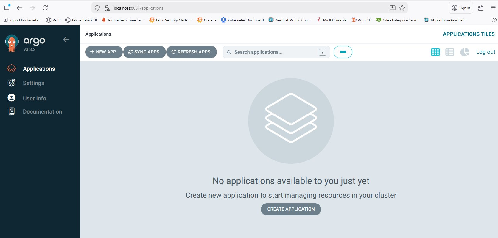
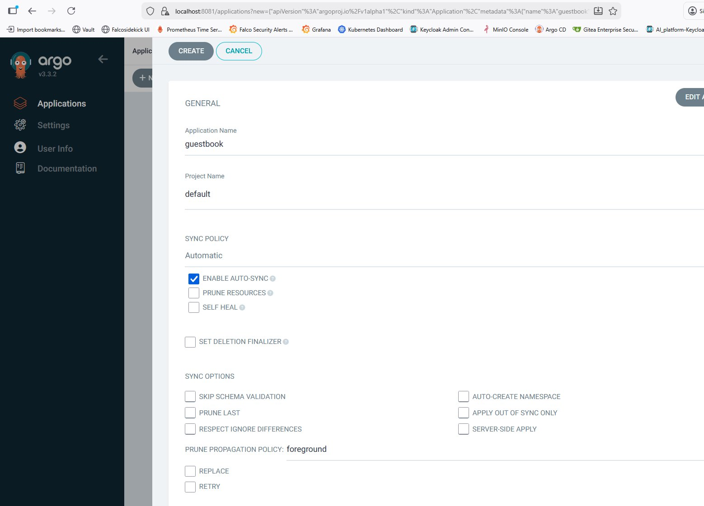
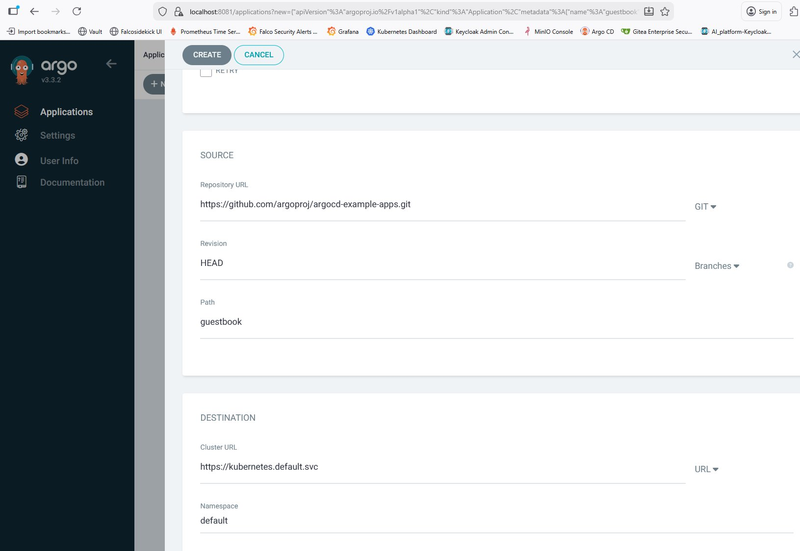
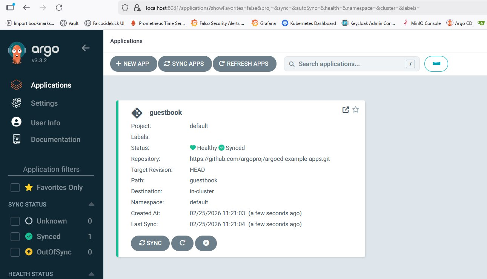

# 🚀 Guide GitOps avec ArgoCD sur AKS

## Vue d'ensemble

Ce guide documente la mise en place de GitOps avec ArgoCD sur AKS pour déployer automatiquement des applications depuis un repository Git.

## 📋 Table des matières

1. [Qu'est-ce que GitOps ?](#quest-ce-que-gitops-)
2. [Architecture](#architecture)
3. [Installation d'ArgoCD](#installation-dargocd)
4. [Accéder à ArgoCD](#accéder-à-argocd)
5. [Déployer une application](#déployer-une-application)
6. [Structure App-of-Apps](#structure-app-of-apps)
7. [Helm Charts avec Values](#helm-charts-avec-values)

---

## Qu'est-ce que GitOps ?

GitOps est une pratique où **Git est la source de vérité** pour l'infrastructure et les applications :

```
┌─────────────────────────────────────────────────────────────────────────┐
│                         GITOPS WORKFLOW                                  │
│                                                                         │
│   Developer                                                             │
│      │                                                                  │
│      │  git push                                                        │
│      ▼                                                                  │
│   ┌─────────────┐        ┌─────────────┐        ┌─────────────┐        │
│   │    Git      │  sync  │   ArgoCD    │ deploy │  Kubernetes │        │
│   │  Repository │───────>│  Controller │───────>│   Cluster   │        │
│   └─────────────┘        └─────────────┘        └─────────────┘        │
│                                │                                        │
│                                │ monitor                                │
│                                ▼                                        │
│                          ┌─────────────┐                               │
│                          │  Self-Heal  │                               │
│                          │  Auto-Sync  │                               │
│                          └─────────────┘                               │
│                                                                         │
│   Avantages:                                                           │
│   ✅ Audit trail complet (Git history)                                 │
│   ✅ Rollback facile (git revert)                                      │
│   ✅ Review process (Pull Requests)                                    │
│   ✅ Self-healing automatique                                          │
└─────────────────────────────────────────────────────────────────────────┘
```

---

## Architecture

### Notre setup GitOps

```
┌─────────────────────────────────────────────────────────────────────────┐
│                      ARCHITECTURE GITOPS                                 │
│                                                                         │
│  GitHub Repository                                                      │
│  hybrid-ai-security-platform/                                           │
│  │                                                                      │
│  ├── argocd/                                                            │
│  │   ├── root-app.yaml              ← App-of-Apps (bootstrap)          │
│  │   └── applications/                                                  │
│  │       ├── openwebui/                                                 │
│  │       │   ├── application.yaml   ← ArgoCD Application               │
│  │       │   └── values.yaml        ← Helm values                      │
│  │       └── langfuse/                                                  │
│  │           ├── application.yaml                                       │
│  │           └── values.yaml                                            │
│  │                                                                      │
│  └── (autres fichiers: terraform, docs, scripts)                       │
│                                                                         │
│                          │                                              │
│                          │ sync                                         │
│                          ▼                                              │
│  ┌─────────────────────────────────────────────────────────────────┐   │
│  │                     AKS CLUSTER                                  │   │
│  │                                                                  │   │
│  │  namespace: argocd                                               │   │
│  │  ┌────────────────────────────────────────────────────────┐     │   │
│  │  │  ArgoCD                                                 │     │   │
│  │  │  • argocd-server (UI + API)                            │     │   │
│  │  │  • argocd-repo-server (Git sync)                       │     │   │
│  │  │  • argocd-application-controller (Deploy)              │     │   │
│  │  └────────────────────────────────────────────────────────┘     │   │
│  │                          │                                       │   │
│  │                          │ deploy                                │   │
│  │                          ▼                                       │   │
│  │  namespace: ai-platform                                          │   │
│  │  ┌────────────────────────────────────────────────────────┐     │   │
│  │  │  Applications                                           │     │   │
│  │  │  • OpenWebUI                                            │     │   │
│  │  │  • (autres apps)                                        │     │   │
│  │  └────────────────────────────────────────────────────────┘     │   │
│  └─────────────────────────────────────────────────────────────────┘   │
└─────────────────────────────────────────────────────────────────────────┘
```

---

## Installation d'ArgoCD

### Sur AKS

```bash
# Créer le namespace
kubectl create namespace argocd

# Installer ArgoCD
kubectl apply -n argocd -f https://raw.githubusercontent.com/argoproj/argo-cd/stable/manifests/install.yaml

# Vérifier les pods
kubectl get pods -n argocd
```

### Pods ArgoCD

| Pod | Rôle |
|-----|------|
| argocd-server | UI Web + API REST |
| argocd-repo-server | Clone et sync les repos Git |
| argocd-application-controller | Déploie les applications |
| argocd-redis | Cache |
| argocd-dex-server | SSO/Authentication |

---

## Accéder à ArgoCD

### Port-forward (développement)

```bash
# Port-forward
kubectl port-forward svc/argocd-server -n argocd 8081:443 &

# Récupérer le mot de passe admin
kubectl -n argocd get secret argocd-initial-admin-secret -o jsonpath="{.data.password}" | base64 -d && echo
```

### Connexion

- **URL** : https://localhost:8081
- **Username** : admin
- **Password** : (mot de passe récupéré ci-dessus)

### Interface ArgoCD

À la première connexion, tu verras l'interface vide :



---

## Déployer une application

### Via l'interface UI

#### Étape 1 : Cliquer sur "NEW APP"


Clique sur **"+ NEW APP"** ou **"CREATE APPLICATION"**.

#### Étape 2 : Remplir la section GENERAL



| Champ | Valeur | Description |
|-------|--------|-------------|
| **Application Name** | guestbook | Nom de l'application |
| **Project Name** | default | Projet ArgoCD |
| **Sync Policy** | Automatic ✅ | Auto-sync depuis Git |

Options de sync :
- **ENABLE AUTO-SYNC** : Sync automatique quand Git change
- **PRUNE RESOURCES** : Supprime les ressources orphelines
- **SELF HEAL** : Recrée les ressources supprimées manuellement

#### Étape 3 : Remplir SOURCE et DESTINATION



**SOURCE** (d'où vient l'application) :

| Champ | Valeur |
|-------|--------|
| **Repository URL** | https://github.com/argoproj/argocd-example-apps.git |
| **Revision** | HEAD |
| **Path** | guestbook |

**DESTINATION** (où déployer) :

| Champ | Valeur |
|-------|--------|
| **Cluster URL** | https://kubernetes.default.svc |
| **Namespace** | default |

#### Étape 4 : Créer l'application

Clique sur **"CREATE"** en haut.

#### Étape 5 : Vérifier le déploiement

L'application apparaît avec le status **Synced** et **Healthy** :



| Info | Valeur |
|------|--------|
| **Status** | 💚 Healthy ✅ Synced |
| **Repository** | argoproj/argocd-example-apps |
| **Path** | guestbook |
| **Destination** | in-cluster / default |

---

## Structure App-of-Apps

### Concept

Au lieu de créer chaque application manuellement, on utilise une **Root App** qui déploie toutes les autres :

```
┌─────────────────────────────────────────────────────────────────────────┐
│                         APP-OF-APPS PATTERN                              │
│                                                                         │
│   root-app.yaml (bootstrap manuel, 1 seule fois)                        │
│        │                                                                │
│        │ sync argocd/applications/*/application.yaml                    │
│        │                                                                │
│        ├───────────────┬───────────────┬───────────────┐               │
│        │               │               │               │               │
│        ▼               ▼               ▼               ▼               │
│   ┌─────────┐    ┌─────────┐    ┌─────────┐    ┌─────────┐            │
│   │OpenWebUI│    │Langfuse │    │  App 3  │    │  App N  │            │
│   └─────────┘    └─────────┘    └─────────┘    └─────────┘            │
│                                                                         │
│   Avantage: Ajouter une app = créer un dossier + git push              │
│             ArgoCD la détecte et déploie automatiquement !             │
└─────────────────────────────────────────────────────────────────────────┘
```

### Structure des fichiers

```
argocd/
├── root-app.yaml                      # Bootstrap (kubectl apply 1x)
└── applications/
    ├── openwebui/
    │   ├── application.yaml           # Définition ArgoCD
    │   └── values.yaml                # Helm values
    └── langfuse/
        ├── application.yaml
        └── values.yaml
```

### root-app.yaml

```yaml
apiVersion: argoproj.io/v1alpha1
kind: Application
metadata:
  name: aks-root-app
  namespace: argocd
spec:
  project: default
  source:
    repoURL: https://github.com/Z3ROX-lab/hybrid-ai-security-platform.git
    targetRevision: HEAD
    path: argocd/applications
    directory:
      recurse: true
      include: '*/application.yaml'
  destination:
    server: https://kubernetes.default.svc
    namespace: argocd
  syncPolicy:
    automated:
      prune: true
      selfHeal: true
```

### Bootstrap

```bash
# Une seule fois !
kubectl apply -f argocd/root-app.yaml
```

Après ça, tout est automatique. Chaque commit dans `argocd/applications/` déclenche un déploiement.

---

## Helm Charts avec Values

### Utiliser un Helm Chart officiel

Pour déployer une application depuis un Helm Chart officiel avec nos propres values :

### application.yaml

```yaml
apiVersion: argoproj.io/v1alpha1
kind: Application
metadata:
  name: openwebui
  namespace: argocd
spec:
  project: default
  sources:
    # Helm chart officiel
    - repoURL: https://helm.openwebui.com
      chart: open-webui
      targetRevision: 12.3.0
      helm:
        releaseName: openwebui
        valueFiles:
          - $values/argocd/applications/openwebui/values.yaml
    # Notre repo avec les values
    - repoURL: https://github.com/Z3ROX-lab/hybrid-ai-security-platform.git
      targetRevision: HEAD
      ref: values
  destination:
    server: https://kubernetes.default.svc
    namespace: ai-platform
  syncPolicy:
    automated:
      prune: true
      selfHeal: true
    syncOptions:
      - CreateNamespace=true
```

### values.yaml

```yaml
# OpenWebUI Helm Values
ollama:
  enabled: false

ollamaUrls:
  - "http://ollama-k3d:11434"

extraEnvVars:
  - name: WEBUI_AUTH
    value: "false"

persistence:
  enabled: false

websocket:
  enabled: false
  redis:
    enabled: false
```

### Workflow

```
1. Modifier values.yaml
2. git commit -m "update openwebui config"
3. git push
4. ArgoCD détecte le changement
5. ArgoCD re-déploie avec les nouvelles values
```

---

## Commandes utiles

### Voir les applications

```bash
kubectl get applications -n argocd
```

### Forcer un sync

```bash
kubectl patch application <app-name> -n argocd --type merge -p '{"operation": {"initiatedBy": {"username": "admin"}, "sync": {}}}'
```

### Voir les logs ArgoCD

```bash
kubectl logs -n argocd -l app.kubernetes.io/name=argocd-application-controller
```

### Supprimer une application

```bash
kubectl delete application <app-name> -n argocd
```

---

## Troubleshooting

### Application "Unknown" ou "OutOfSync"

```bash
# Voir le détail
kubectl get application <app-name> -n argocd -o yaml | grep -A 10 "status:"
```

### Pod en erreur

```bash
# Logs de l'application
kubectl logs -n <namespace> -l app=<app-name>
```

### Forcer un hard refresh

```bash
kubectl delete application <app-name> -n argocd
# La root-app va la recréer automatiquement
```

---

## Résumé

| Concept | Description |
|---------|-------------|
| **GitOps** | Git = source de vérité |
| **ArgoCD** | Contrôleur GitOps pour Kubernetes |
| **App-of-Apps** | Une root-app qui déploie toutes les autres |
| **Helm + Values** | Charts officiels + notre configuration |
| **Auto-sync** | Déploiement automatique à chaque commit |

```
git push → ArgoCD sync → Kubernetes deploy → Application running !
```

---

*Document créé le 25/02/2026 - Projet hybrid-ai-security-platform*
*Auteur : Stéphane (Z3ROX) - Lead SecOps/Cloud Security Architect*
