# Hybrid AI Security Platform — Demo Tests

**Date:** 2026-02-27
**Platform:** K3d (local) + Azure AKS (cloud) — Hybrid Architecture
**Author:** Z3ROX — Lead SecOps / Cloud Security Architect

---

## Architecture Overview

```
User → Open WebUI → LLM Guard Pipeline → RAG Pipeline → Ollama (Mistral)
                         ↓                      ↓
                   Guardrails API          Qdrant (Vector DB)
                   (Prompt Injection,      (Document Q&A)
                    PII Detection)
```

**Infrastructure:**
- **Local (K3d):** 3-node cluster — 1 server + 2 agents, running AI workloads, security tooling, and observability stack
- **Cloud (AKS):** Azure Kubernetes Service connected via Azure Arc
- **Connectivity:** ngrok tunnel for hybrid access
- **GitOps:** ArgoCD for deployment management

---

## Test Results Summary

| # | Test | Status |
|---|------|--------|
| 1 | OpenWebUI + Ollama | ✅ Pass |
| 2 | Hybrid Connectivity (ngrok) | ✅ Pass |
| 3 | RAG Pipeline | ✅ Pass |
| 4 | Azure Arc | ✅ Pass |
| 5 | Azure Policy | ✅ Pass |
| 6 | Kyverno Policies | ✅ Pass |
| 7 | Falco Runtime Security | ✅ Pass |
| 8 | Trivy Vulnerability Scanning | ✅ Pass |
| 9 | Monitoring (Grafana) | ✅ Pass |
| 10 | Azure Defender | ✅ Pass |
| 11 | Entra ID + Keycloak | 🔲 Pending |

**Score: 10/11 tests passed**

---

## Test 1 — OpenWebUI + Ollama (Mistral)

**Objective:** Validate that OpenWebUI is connected to Ollama and can chat with the Mistral LLM.

**Evidence:**
- OpenWebUI accessible via `localhost:8083` (port-forward) and ngrok tunnel
- Mistral model visible with green status indicator (connected)
- Successful chat interaction: query about "hybrid cloud architecture" returned detailed response

### OpenWebUI — Models

Mistral 7B connected (green indicator), nomic-embed-text for RAG embeddings:

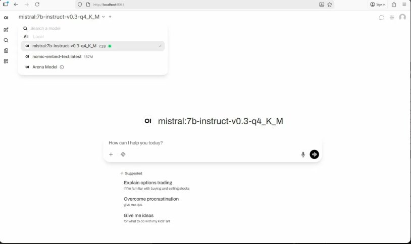

### OpenWebUI — Chat

Mistral responding to "Explain in 3 sentences what is a hybrid cloud architecture":

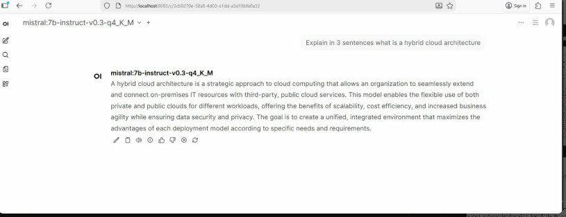

---

## Test 2 — Hybrid Connectivity (ngrok)

**Objective:** Validate hybrid connectivity between local K3d cluster and external access via ngrok tunnel.

**Evidence:**
- ngrok tunnel active: `https://untorpedoed-domitila-diphase.ngrok-free.dev`
- Dashboard shows POST /api/chat traffic flowing through the tunnel
- Full request/response payloads visible — Mistral model inference via tunnel

### ngrok — Traffic Inspector

POST /api/chat requests with 200 OK responses and full JSON payloads:

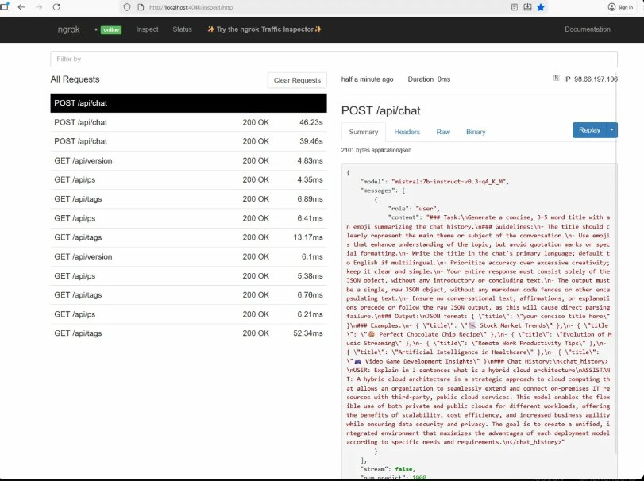

### ngrok — Response Detail

200 OK response showing Mistral model, prompt_eval_duration, and chat_history:

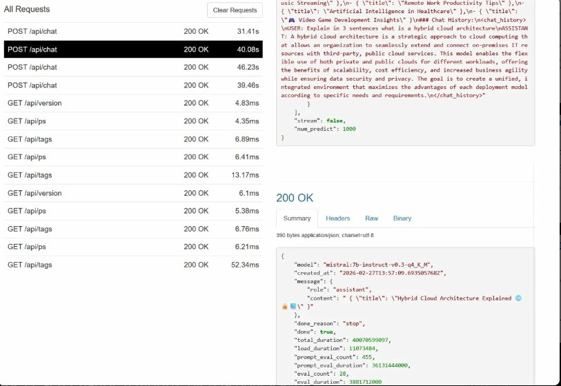

---

## Test 3 — RAG Pipeline (Retrieval-Augmented Generation)

**Objective:** Validate the RAG pipeline can ingest documents and answer questions based on document context.

**Architecture:** User → Open WebUI → RAG Context Pipeline → Qdrant (vector search) → Ollama (Mistral)

**Evidence:**
- Uploaded `GUIDE-AZURE-INFRASTRUCTURE.md` to Qdrant vector database
- RAG pipeline successfully summarized the document content
- Context-aware responses referencing AKS, PostgreSQL, Key Vault

### RAG — Document Summary

Mistral summarizing GUIDE-AZURE-INFRASTRUCTURE.md via RAG pipeline (1 source retrieved):

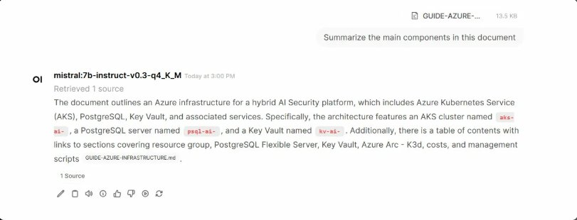

---

## Test 4 — Azure Arc (Hybrid Cluster Management)

**Objective:** Validate that the local K3d cluster is registered and visible in Azure Arc.

**Evidence:**
- K3d cluster visible in Azure Arc → Kubernetes clusters
- Status: **Connected**
- Cluster details: 3 nodes, 24 cores, K3s distribution
- Resource group: `rg-ai-platform-dev`

### Azure Arc — Cluster List

K3d cluster registered as `k3d-ai-security-platform` in France Central:

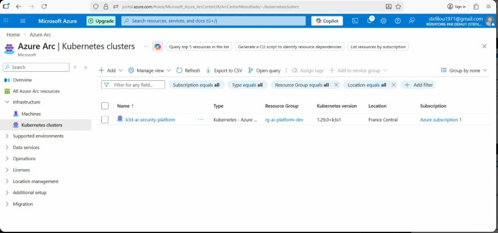

### Azure Arc — Cluster Details

Connected status, 3 nodes, 24 cores, Kubernetes 1.29.0+k3s1, extensions: azurepolicy:

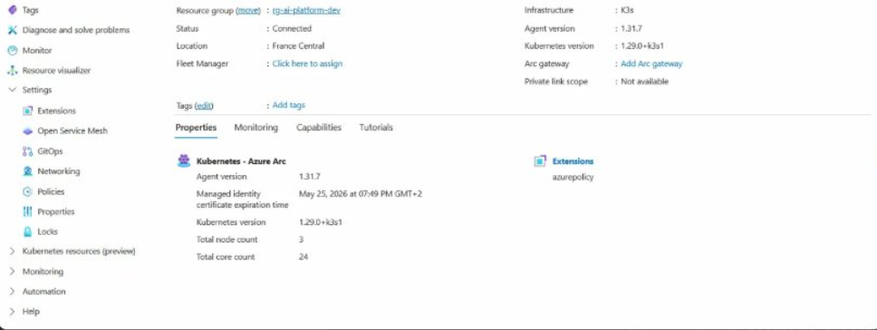

### Resource Group

Full resource group with AKS, K3d (Arc), Key Vault, PostgreSQL, NSG, VNet:

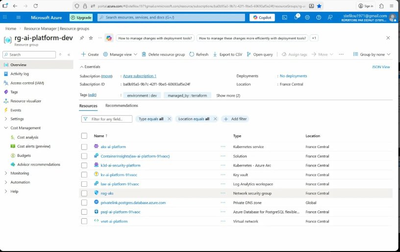

---

## Test 5 — Azure Policy (Compliance)

**Objective:** Validate Azure Policy is evaluating compliance on the Arc-connected K3d cluster.

**Evidence:**
- 14 non-compliant policies detected on the K3d cluster
- 0% overall compliance (expected for homelab with security tooling requiring elevated privileges)
- Non-compliant pods identified: keycloak, falco, falcosidekick, prometheus, loki

### Azure Policy — Overview

14 non-compliant policies, 1 non-compliant initiative (ASC Default):

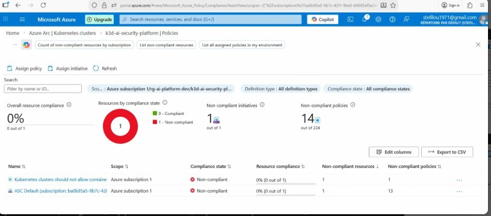

### Azure Policy — Non-Compliant Pods

Detail: "Kubernetes clusters should not allow container privilege escalation" — 7 non-compliant components:

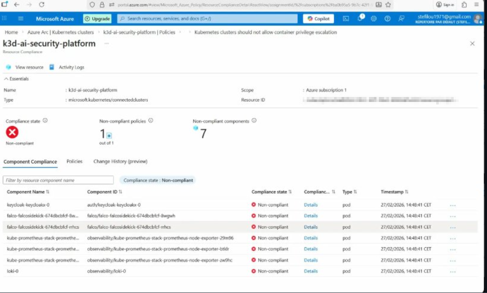

---

## Test 6 — Kyverno Policies

**Objective:** Validate Kyverno policy engine is enforcing/auditing security policies on the cluster.

**Evidence:**
- 6 ClusterPolicies active in **Audit** mode
- Policies include: `disallow-privileged-containers`, and other pod security policies
- Audit mode chosen intentionally to not block security tooling (Falco, Loki) that requires elevated privileges

### Kyverno — ClusterPolicies List

6 policies active (7d1h), all Ready, Admission + Background enabled:

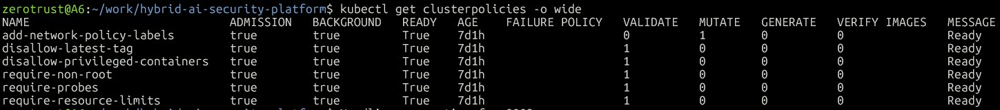

### Kyverno — Disallow Privileged Containers (YAML)

Policy detail: `validationFailureAction: Audit`, severity: high, excludes system namespaces (kube-system, argocd, falco, observability, etc.):

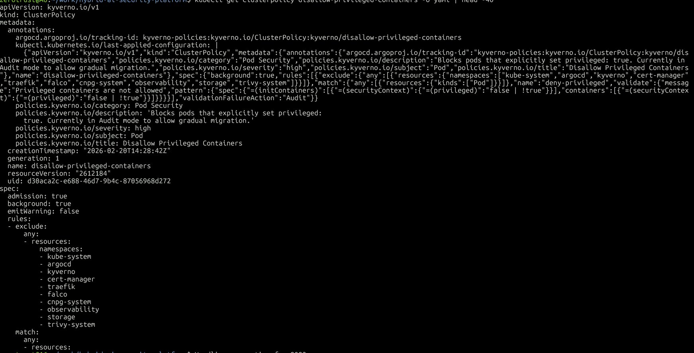

---

## Test 7 — Falco Runtime Security

**Objective:** Validate Falco detects suspicious runtime behavior in AI workloads, specifically OWASP LLM Top 10 threats.

**Architecture:** Falco DaemonSet (3 pods, one per node) → Falcosidekick → Loki → Grafana

**Evidence:**
- Falco DaemonSet running across all 3 nodes (namespace: `falco`)
- Custom rule **"Suspicious Access to Model Files"** detecting access to ML model files
- Tags: `OWASP-LLM10`, `ai-security`, `model-theft`
- Alerts generated from `transformers/models/*` file access (xlnet, xmod, yolos, yoso, zamba)

**Alert example (JSON):**
```json
{
  "rule": "Suspicious Access to Model Files",
  "priority": "Warning",
  "source": "syscall",
  "tags": ["OWASP-LLM10", "ai-security", "model-theft"],
  "hostname": "k3d-ai-security-platform-agent-0",
  "output_fields": {
    "fd.name": "/var/lib/.../transformers/models/yolos",
    "user.name": "root",
    "proc.cmdline": "containerd"
  }
}
```

### Falco — CLI Logs (OWASP-LLM10 Alerts)

`kubectl logs` showing "Suspicious Access to Model Files" with tags `["OWASP-LLM10","ai-security","model-theft"]`:

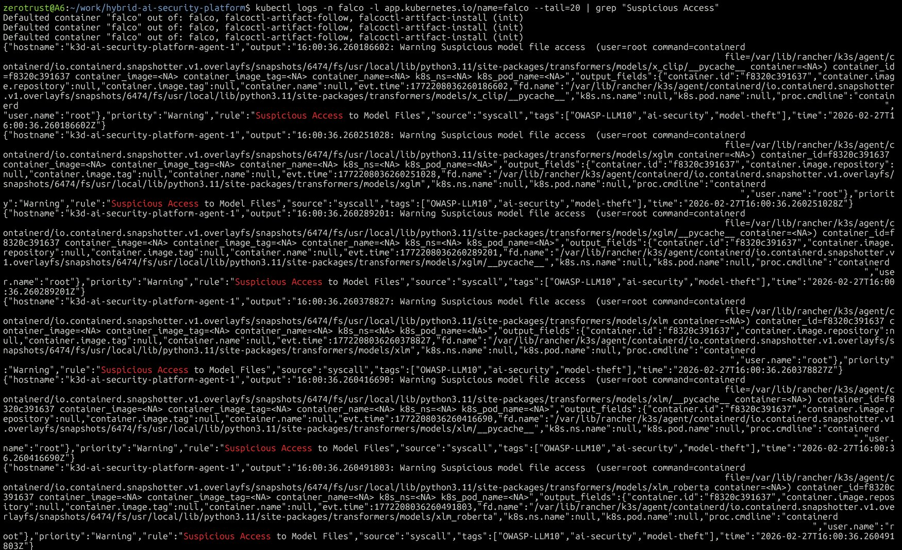

### Grafana — Falco Alerts Explore (Loki)

Loki query: `{namespace="falco"} |= "Warning" | json | line_format "{{.rule}} - {{.priority}}"`

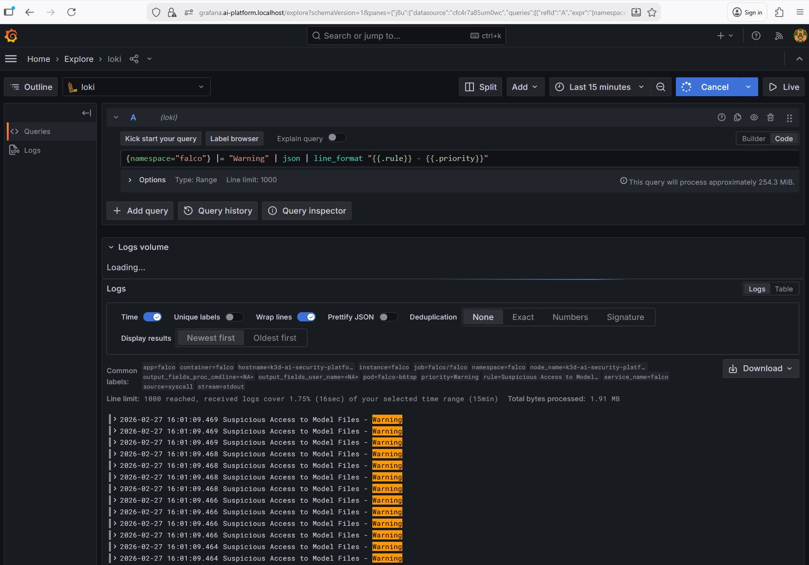

### Grafana — Falco Security Alerts Dashboard

Custom dashboard with Alert Timeline, pie charts, and OWASP-LLM log panel:

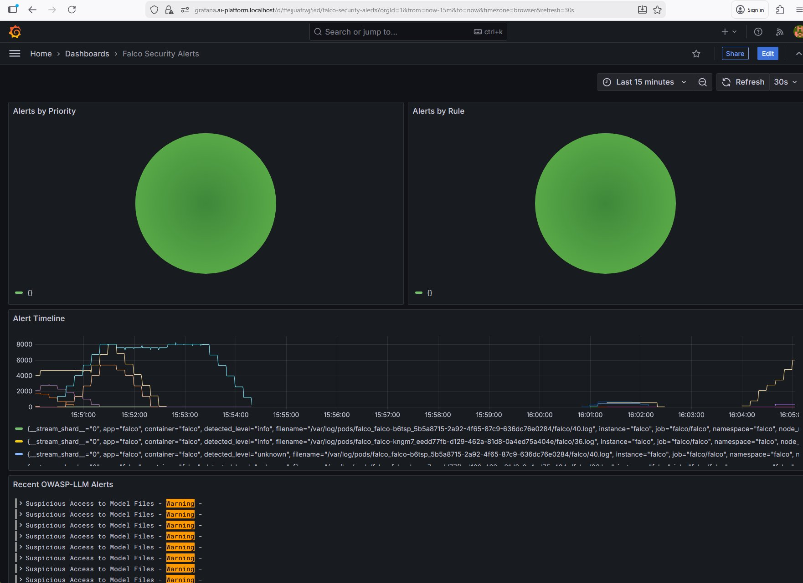

### Grafana — Falco Alert Detail

Expanded log showing hostname, node_name, output with model file path:

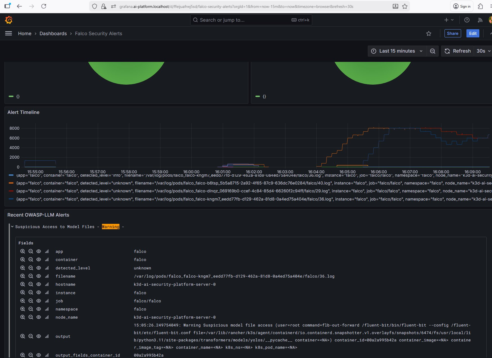

### Grafana — Falco Alert Fields

Detailed fields: `rule: Suspicious Access to Model Files`, `priority: Warning`, `source: syscall`:

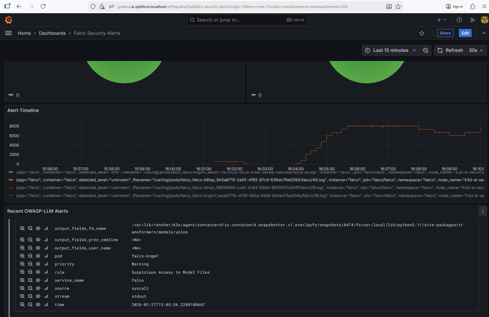

---

## Test 8 — Trivy Vulnerability Scanning

**Objective:** Validate Trivy Operator scans container images for vulnerabilities and reports to Grafana via Prometheus.

**Architecture:** Trivy Operator → VulnerabilityReports (CRDs) → Prometheus metrics → Grafana

### CLI Scan Results

5 images scanned in `ai-inference` namespace — **8 Critical, 73 High, 206 Medium**:

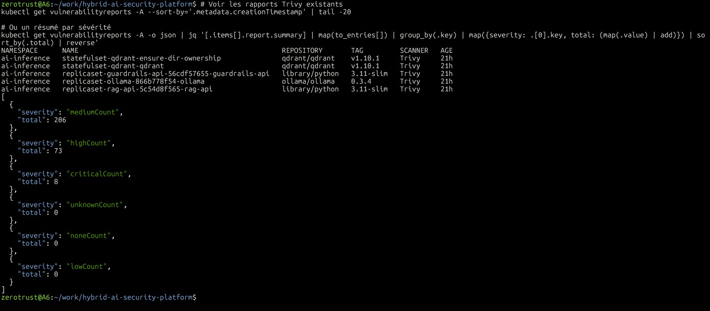

| Image | Tag | Scanner | Age |
|-------|-----|---------|-----|
| qdrant/qdrant | v1.10.1 | Trivy | 21h |
| ollama/ollama | 0.3.4 | Trivy | 21h |
| library/python | 3.11-slim | Trivy | 21h |

### Grafana — Trivy Vulnerability Scanner Dashboard

Custom dashboard with pie chart (by severity), bar gauge (by image), and detailed table:

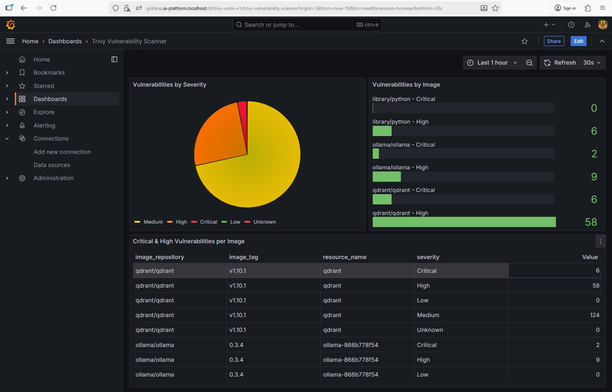

| Image | Critical | High | Medium |
|-------|----------|------|--------|
| qdrant/qdrant v1.10.1 | 6 | 58 | 124 |
| ollama/ollama 0.3.4 | 2 | 9 | 80 |
| library/python 3.11-slim | 0 | 6 | — |

---

## Test 9 — Monitoring & Observability (Grafana)

**Objective:** Validate the complete observability stack is operational.

**Stack:**
- **Prometheus:** Metrics collection (kube-prometheus-stack)
- **Grafana:** Visualization and dashboards
- **Loki:** Log aggregation
- **Promtail:** Log shipping from all pods

### Grafana Login

Accessible via Traefik ingress at `https://grafana.ai-platform.localhost`:

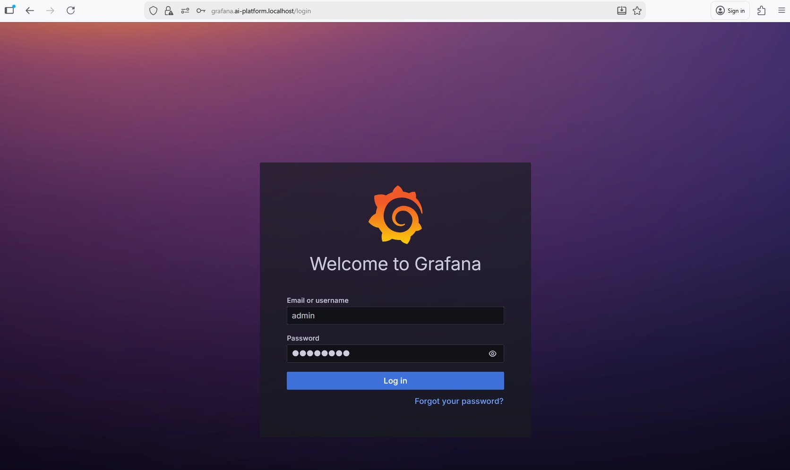

### Grafana Dashboards

20+ pre-configured dashboards including Kubernetes, CoreDNS, Alertmanager, Falco logs, and custom security dashboards:

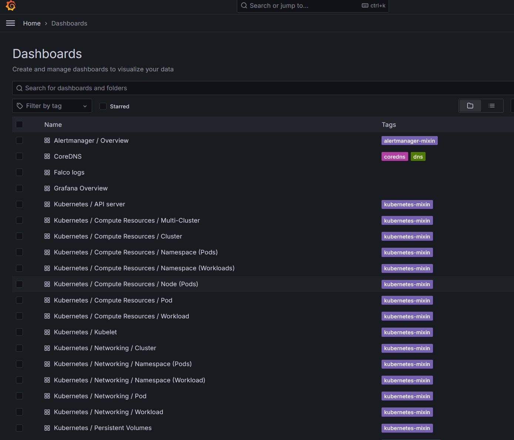

**Key pods (observability namespace):**
```
kube-prometheus-stack-grafana          3/3 Running
prometheus-kube-prometheus-stack       2/2 Running
alertmanager-kube-prometheus-stack     2/2 Running
loki-0                                 2/2 Running
promtail (x3)                          1/1 Running
kube-state-metrics                     1/1 Running
node-exporter (x3)                     1/1 Running
```

---

## Test 10 — Azure Defender for Cloud

**Objective:** Validate Microsoft Defender for Cloud monitors the Azure resources and provides security recommendations.

### Overview

Defender for Cloud active — 5 assessed resources, Security Posture visible:

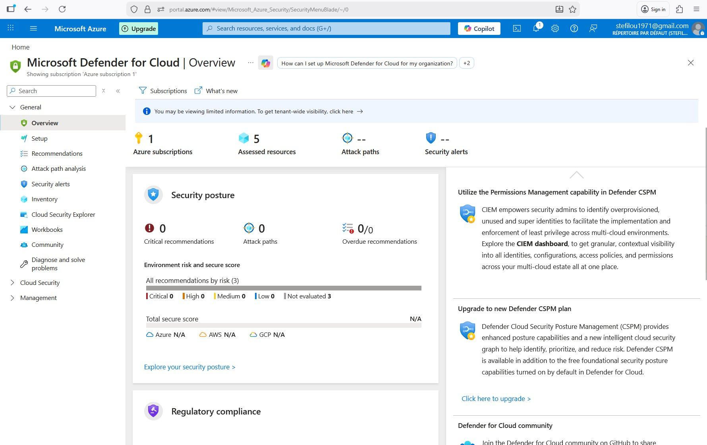

### Recommendations

3 security recommendations identified (subnets NSG, subscription owners):

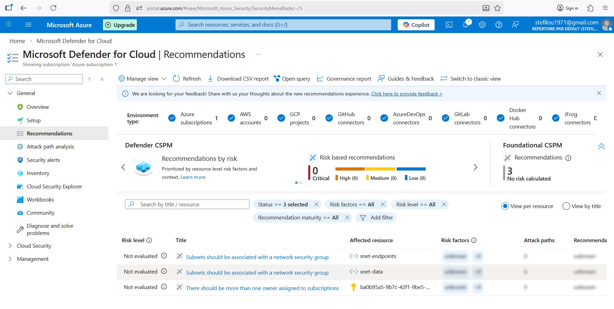

### Security Alerts

Clean posture — 0 active security alerts:

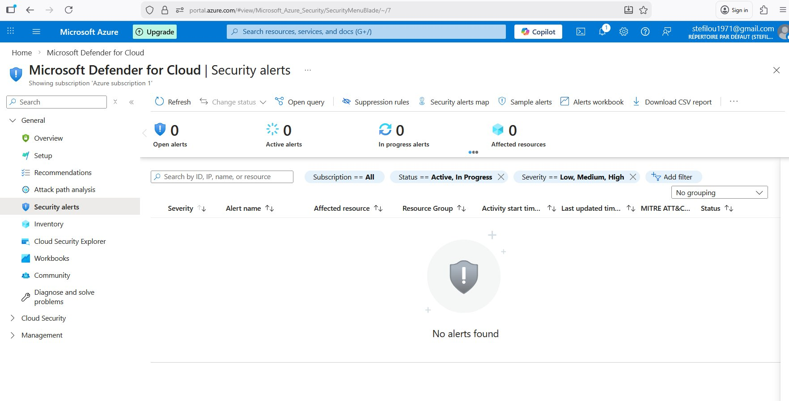

---

## Test 11 — Entra ID + Keycloak (SSO/OIDC)

**Status:** 🔲 Pending

**Objective:** Validate Keycloak integration with Microsoft Entra ID for SSO authentication to the AI platform.

---

## OWASP LLM Top 10 Coverage

| OWASP LLM | Threat | Mitigation | Tool |
|------------|--------|------------|------|
| LLM01 | Prompt Injection | LLM Guard Pipeline — input sanitization | LLM Guard |
| LLM02 | Insecure Output Handling | LLM Guard Pipeline — output filtering | LLM Guard |
| LLM03 | Training Data Poisoning | Image scanning for known CVEs | Trivy |
| LLM04 | Model Denial of Service | Resource limits, Kyverno policies | Kyverno |
| LLM05 | Supply Chain Vulnerabilities | Container image vulnerability scanning | Trivy |
| LLM06 | Sensitive Information Disclosure | PII detection in LLM Guard | LLM Guard |
| LLM07 | Insecure Plugin Design | Network policies, RBAC | Kyverno, K8s |
| LLM08 | Excessive Agency | RBAC, least privilege | Kyverno |
| LLM09 | Overreliance | Audit logging, observability | Grafana, Loki |
| LLM10 | Model Theft | Runtime detection of model file access | Falco |

---

## Security Stack Summary

```
┌─────────────────────────────────────────────────────┐
│                  AZURE CLOUD                         │
│  ┌──────────┐  ┌────────────┐  ┌─────────────────┐  │
│  │   AKS    │  │ Azure Arc  │  │ Defender for    │  │
│  │ Cluster  │  │ (Hybrid)   │  │ Cloud           │  │
│  └──────────┘  └────────────┘  └─────────────────┘  │
│  ┌──────────────────────────────────────────────┐    │
│  │ Azure Policy (14 policies evaluated)         │    │
│  └──────────────────────────────────────────────┘    │
└─────────────────────────────────────────────────────┘
                        │ Azure Arc
                        ▼
┌─────────────────────────────────────────────────────┐
│              K3D LOCAL CLUSTER (3 nodes)             │
│                                                      │
│  ┌─── AI Inference ─────────────────────────────┐   │
│  │ OpenWebUI → LLM Guard → RAG → Ollama(Mistral)│   │
│  │ Qdrant (Vector DB) │ Guardrails API           │   │
│  └───────────────────────────────────────────────┘   │
│                                                      │
│  ┌─── Security ─────────────────────────────────┐   │
│  │ Falco (DaemonSet) │ Kyverno │ Trivy Operator │   │
│  │ OWASP-LLM10 rules │ 6 policies │ CVE scans   │   │
│  └───────────────────────────────────────────────┘   │
│                                                      │
│  ┌─── Observability ────────────────────────────┐   │
│  │ Prometheus │ Grafana │ Loki │ Promtail        │   │
│  │ Alertmanager │ Node Exporter │ kube-state     │   │
│  └───────────────────────────────────────────────┘   │
│                                                      │
│  ┌─── Networking ───────────────────────────────┐   │
│  │ Traefik (Ingress) │ ngrok (Hybrid Tunnel)     │   │
│  └───────────────────────────────────────────────┘   │
└─────────────────────────────────────────────────────┘
```

---

## Screenshot Index

| # | Filename | Description |
|---|----------|-------------|
| 1 | `openwebui-models.png` | OpenWebUI with Mistral connected (green indicator) |
| 2 | `openwebui-chat.png` | Mistral response — hybrid cloud architecture |
| 3 | `ngrok-traffic.png` | ngrok Traffic Inspector — POST /api/chat |
| 4 | `ngrok-traffic-response.png` | ngrok response detail — 200 OK with Mistral payload |
| 5 | `rag-document.png` | RAG summary of GUIDE-AZURE-INFRASTRUCTURE.md |
| 6 | `azure-arc-list.png` | Azure Arc — K3d cluster registered |
| 7 | `azure-arc-details.png` | Azure Arc — 3 nodes, 24 cores, Connected |
| 8 | `resource-group.png` | Resource Group — AKS + K3d + KeyVault + PostgreSQL |
| 9 | `azure-policy-arc.png` | Azure Policy — 14 non-compliant policies |
| 10 | `azure-policy-details.png` | Azure Policy — non-compliant pods detail |
| 11 | `trivy-cli-scan.png` | Trivy CLI — 8 Critical, 73 High, 206 Medium |
| 12 | `kyverno-policies.png` | Kyverno — 6 ClusterPolicies active |
| 13 | `kyverno-policy-yaml.png` | Kyverno — Disallow Privileged Containers YAML |
| 14 | `falco-logs.png` | Falco CLI — OWASP-LLM10 alerts with tags |
| 15 | `grafana-login.png` | Grafana login via Traefik |
| 16 | `grafana-dashboards.png` | Grafana — 20+ dashboards list |
| 17 | `grafana-falco-explore.png` | Loki Explore — Falco Warning alerts |
| 18 | `grafana-falco-dashboard.png` | Falco Dashboard — Timeline + Pie charts + Logs |
| 19 | `grafana-falco-detail.png` | Falco — expanded alert with output fields |
| 20 | `grafana-falco-fields.png` | Falco — rule, priority, source fields |
| 21 | `grafana-trivy-dashboard.png` | Trivy Dashboard — Pie + Bar gauge + Table |
| 22 | `azure-defender-overview.png` | Defender — Overview, 5 resources |
| 23 | `azure-defender-recommendations.png` | Defender — 3 recommendations |
| 24 | `azure-defender-alerts.png` | Defender — 0 alerts (clean) |

---

## Environment Details

| Component | Version / Details |
|-----------|-------------------|
| K3d Cluster | 3 nodes (1 server + 2 agents), 24 cores |
| AKS | Azure Kubernetes Service |
| Ollama | 0.3.4 (Mistral model) |
| Qdrant | v1.10.1 |
| Falco | DaemonSet, 3 pods |
| Kyverno | 6 ClusterPolicies (Audit mode) |
| Trivy Operator | Continuous scanning |
| Grafana | kube-prometheus-stack |
| Loki | Single-node, log aggregation |
| Traefik | Ingress controller |
| ngrok | Hybrid tunnel |
| ArgoCD | GitOps deployment |

---

## Key Takeaways

1. **Defense in Depth:** Multiple overlapping security layers — from cloud (Defender, Azure Policy) to cluster (Kyverno, Falco, Trivy) to application (LLM Guard)
2. **OWASP LLM Top 10 Coverage:** All 10 categories addressed with specific tooling
3. **Hybrid Architecture:** Seamless management of on-prem and cloud clusters via Azure Arc
4. **Full Observability:** Prometheus + Grafana + Loki providing metrics, dashboards, and log aggregation
5. **GitOps Ready:** ArgoCD-driven deployments for reproducibility and audit trails
6. **Open Source Stack:** Entire security stack built on OSS tools, demonstrating enterprise-grade security without vendor lock-in
